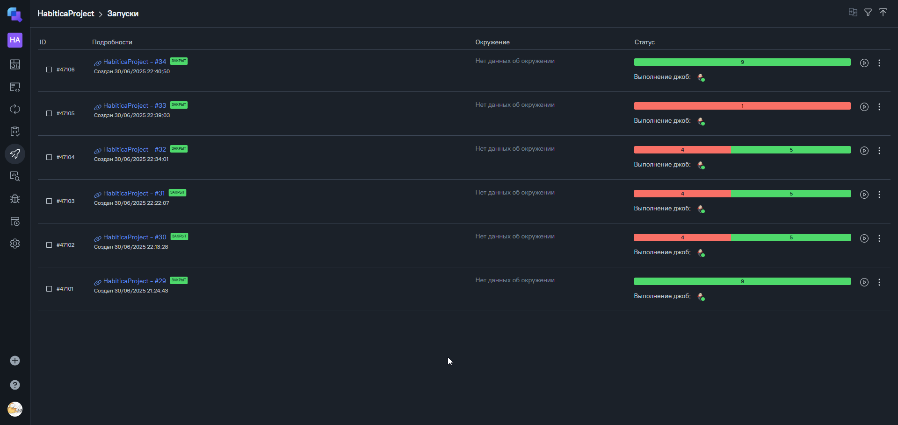
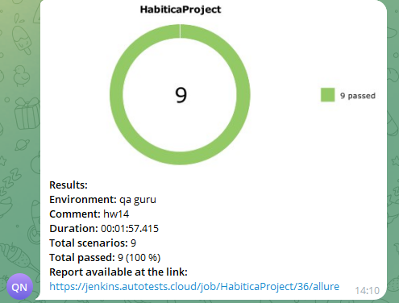

# Проект по тестированию менеджера задач Habitica

> [Ссылка на сайт Habitica](https://habitica.com)


---

## Список проверок, реализованных в автотестах:

### UI-тесты

- [x] Регистрация пользователя (успешная и неуспешная)
- [x] Авторизация пользователя (успешная и неуспешная)
- [x] Работа валидации в формах регистрации и авторизации
- [x] Параметризированный тест на создание всех типов задач

### API-тесты

- [x] Авторизация пользователя (успешная и неуспешная)
- [x] Проверка жизненного цикла всех типов задач (создание -> проверка типа/текста -> удаление -> проверка)
- [x] Параметризированный тест на жизненный цикл всех типов задач
- [x] Редактирование задачи
- [x] Изменение позиции задачи в списке (move to top/bottom)

----

## Проект реализован с использованием:

        

- Язык: `Python`
- Тесты: WEB UI, API
- Для написания UI-тестов используется фреймворк `Selene`, "обёртка" вокруг `Selenium WebDriver`
- Библиотека модульного тестирования: `PyTest`
- `Jenkins` выполняет удаленный запуск тестов.
- `Selenoid` запускает браузер с тестами в контейнерах `Docker` (и записывает видео)
- Фреймворк`Allure Report` собирает графический отчет о прохождении тестов
- После завершения тестов `Telegram Bot` отправляет в `Telegram` краткий вариант отчёта
- Полная статистика по прохождению тестов хранится в `Allure TestOps`
- Настроена интеграция `Allure TestOps` с `Jira`

---

## Структура проекта

```
HabiticaProject/
├── model/                                      # Page Objects
│   ├──api/
│       ├── schemas                             # Схемы response/request
│       ├── auth.py                             # Методы авторизации
│       └── tasks.py                            # Методы управления задачами
│   └── ui/
│       ├── steps
            └── login_steps.py                  # Шаги для вариантов авторизации
        └──web_pages/                 
│           ├── dashboard_page.py               # Дашборд задач в аккаунте
│           ├── login_page.py                   # Страница авторизации
│           └── main_page.py                    # Главная страница
├── tests/                              
│       ├──api_test/                            # API Тесты
            ├── conftest.py                     # Конфигурация pytest
│           ├── test_auth.py                    # Тесты формы авторизации
│           └── test_task_management.py         # Тесты на управление задачами
│       └──ui.tests/                            # UI Тесты
│           ├── conftest.py                     # Конфигурация pytest
│           ├── test_add_task.py                # Тесты на добавление задач 
│           ├── test_login.py                   # Тесты формы авторизации    
│           └── test_registration.py            # Тесты формы регистрации
├── utils/                                      # Функции для Allure
    ├── api_logger.py
│   └── web_attach.py                           
├── .env                                        # Переменные окружения
├── requirements.txt                            # Зависимости проекта
└── pytest.ini                                  # Конфигурация pytest
```

---

## Особенности фреймворка

### Page Object Pattern

- Использование паттерна Page Object для инкапсуляции селекторов и действий
- Методы для проверки видимости элементов
- Методы для взаимодействия с элементами (click, send_keys, open)

### Allure Reporting

- Подробные шаги тестов
- Скриншоты при падении тестов
- Логи браузера
- HTML-снапшоты страниц
- Видео выполнения тестов

### Конфигурация

- Поддержка разных окружений через переменные окружения
- Настройка браузера через Selenoid
- Возможность запуска в headless режиме

---

### Локальный запуск
> Перед запуском в корне проекта создать файл .env с содержимым:
```
SELENOID_LOGIN={selenoid login}
SELENOID_PASS={selenoid password}
SELENOID_URL={selenoid server}
HABITICA_BASE_URL=https://habitica.com/api/v3
HABITICA_X_CLIENT={x_client of your test Habitica account}
HABITICA_X_API_USER={x_api_user of your test Habitica account}
HABITICA_USERNAME={username of your test Habitica account}
HABITICA_EMAIL={email of your test Habitica account}
HABITICA_PASSWORD={password of your test Habitica account}
```

> Для локального запуска с дефолтными настройками необходимо выполнить:
```
python -m venv .venv
source .venv/bin/activate
pip install -r requirements.txt
pytest tests/web
```
---

### Удаленный запуск автотестов выполняется на сервере Jenkins
> [Ссылка на проект в Jenkins](https://jenkins.autotests.cloud/job/HabiticaProject/)

#### Параметры сборки

- `SUITE` - набор тестов(WEB или API тесты. Tests - все)
- `BROWSER_VERSION` - версия браузера (браузер `Chrome`) для Web тестов

#### Для запуска автотестов в Jenkins

1. Открыть [проект](https://jenkins.autotests.cloud/job/HabiticaProject/)
2. Выбрать пункт `Build with Parameters`
3. Выбрать модуль
4. Указать версию браузера (только для Web тестов)
5. Указать комментарий
6. Нажать кнопку `Build`
7. Результат запуска сборки можно посмотреть в отчёте Allure

---

## Allure отчет

### Общие результаты прохождения UI тестов


### Список UI тест кейсов и пример отчета о прохождении теста


---

## Полная статистика хранится в Allure TestOps

> [Ссылка на проект в AllureTestOps](https://allure.autotests.cloud/project/4822/dashboards)

### Дашборд с общими показателями тестовых прогонов


### История запуска тестовых наборов



### Тест кейсы


---

### Интеграция с Jira

> [Ссылка на проект в Jira](https://jira.autotests.cloud/browse/HOMEWORK-1477)


---

### Оповещение о результатах прогона тестов в Telegram

> [Ссылка на канал в Telegram](https://t.me/+lAeNRkltTRU0ZDIy)



---

### Пример видео прохождения UI-автотеста

